# HLA Unity using Pitch RTI

Owner: Anubhav Kumar
Tags: Guides and Processes
Date: August 4, 2023

**Acronyms**

- **HLA –** High Level Architecture
- **DLL –** Dynamic-Link Library
- **RTI –** RunTime Infrastructure
- **SOM –** Simulation Object Model
- **FOM –** Federation Object Model

## **Introduction**

This research objective was to understand HLA and to develop a medium to make a simulation project based on unity, HLA compliant.

### **What is HLA?**

HLA stands for High Level Architecture, is an architecture that enables several simulation systems to work & interact together. This interaction is known as interoperability and is accomplished based on a set of rules and tools.

Most simulation systems are useful on their own. With HLA we can combine them to simulate more complex scenarios by letting them exchange data in real-time.

For example, a flight simulator can send information about the position and movement of aircraft to a radar simulation, which can then show those aircraft on its screen. This way, all the different components of the simulation can cooperate and respond to each other's actions, creating a more comprehensive and immersive experience.

### **HLA Terminology?**

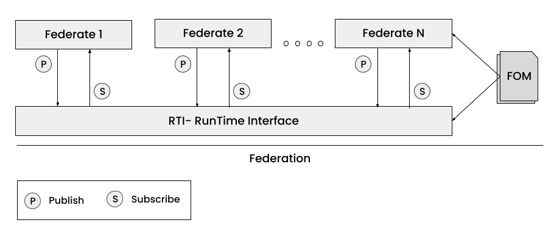

The above diagram represents a basic topology of HLA, where a number of simulation systems connect to a bus service (RTI).

There are following concepts that are particularly important in the above representation, mentioned below.

- The RunTime Interface (RTI), is a software that provides the HLA services such as sending the right information to the right receiver.
- The Federate. Is a system that connects to the RTI, typically a simulation.
- The Federation, is all the federates together with the RTI that they connect to and the FOM that they use.
- The Federation Object Model (FOM), is a file that contains a description of the data exchange in the federation.

### **Content of FOM**

.png)

In FOM, we have the following things:

- Object classes - Something that persists over time and has attributes whose values can be updated. Example: An Aircraft is an object with attributes such as Name, Position, Speed etc.
- Interaction classes - Something that does not persist over time. Such as Start, Stop, ‘MissileLaunch’ events.
- Attributes - They are part of object classes or refer to as parameters for the interactions classes, are information that needs to be sent/received.
- Data types - As the word suggests, describes the semantics and technical representation of the attributes of an object class and parameters of an interaction.

### **Services**

**Information Services**

Enables federates to exchange data according to the FOM using Publish/Subscribe scheme. The RTI keeps track of which federate is publishing a certain data and which is subscribing to it.

.png)

**Coordination Services**

- Management of federation executions and federates that are joined to a federation execution.
- Transfer of modeling responsibilities. Meaning that one simulation (suppose an Aircraft) can delegate the responsibility of updating the value of a particular Aircraft to another simulation.

**Synchronization Services**

- Handling of logical time. Some federations run in real time, others might run faster or slower than the real time. To be able to correctly exchange simulation data with timestamps, the RTI can coordinate both how fast the simulator advances logical or scenario time as well as correct delivery of the time stamped data.
- Synchronization points that enable the members of the federation to coordinate when they have reached a certain state, such as starting a new phase of simulation.
- Save/restore, makes it possible to store a snapshot of a simulation at a given time.

**Grouping of Services**

| Federation Management | Keep track of federation executions and
federates, synchronization points,
save/restore. |
| --- | --- |
| Declaration Management | Publish and subscribe of object and
interaction classes |
| Object Management | Registering and discovering object
instances, updating and reflecting
attributes, sending and receiving
interactions |
| Ownership Management | Transfer of modeling responsibilities |
| Time Management | Handling of logical time including delivery
of time stamped data and advancing
federate time |
| Data Distribution Management | Filtering based on data values |
| Support Services | Utility functions |
| Management Object Model | Inspection and management of the federation |

## **Prerequisites**

To achieve our objection, i.e., to make a Unity based simulation HLA compliant, capable of sharing information, we have to first look for a method that will allow us to communicate with RTI and with that means we also need a RTI.

So we have landed on using PitchRTI (free version) to test out our process. And the medium is that we have to create a Native plugin, a .dll file, which will act as a wrapper for Unity to interact with RTI.

<aside>
💡 **Note:** There are also some open source RTIs present, but are no longer maintained, hence creating plugin using those was a headache. Also, a plugin made using one RTI, cannot be utilized using another. Meaning to use the plugin and to connect & interact with Federation we must have the same RTI i.e., Pitch RTI.

</aside>

### **Tools (Windows x64)**

- **[Pitch RTI (GUI)](https://pitchtechnologies.com/hlatutorial/)**
    - From the above mentioned link, install pitchRTI, and starter kit.
    - The free version provides us the ability to connect up to 2 Federates.
    - When installed, you will have some system environment variables set. For ex: `PRTI1516E_HOME: C:\Program Files\prti1516ePRTI5_BASIC: C:\Program Files\prti1516e\lib`

and many more. Do make sure you have them set. From here we will get access to headers & libraries that will be used in creating the plugin.

- **[SimGe](https://user.ceng.metu.edu.tr/~otopcu/simge/)**
    - This is an open source FOM generator. We are going to use this since Pitch Visual OMT Free version does not allow us to export or import the generated FOM file.
- **[GCC compiler (MinGW)](https://sourceforge.net/projects/mingw-w64/)**
    - To compile the C++ (standard 14) code for dll. We are using [CMake](https://cmake.org/download/) for compilation, so make sure to install that too. Make sure to add a path to the system environment. (Also require MS Visual C++ 2015 to 2022 redistributable package (x64) 14.32.31332)
- **Visual Studio** - For building the `.dll` file. Also, be sure to also have Visual Studio 2017 (VC141) platform toolset and `Windows 10.0.22000.0 SDK`, otherwise it will fail to build.
- Unity - Because, we have to create our simulation application and consume dll using C# script. (No compromise here!!)

## **Implementation**

Let’s start with FOM (Federation Object Model).

**FOM Generation (SimGe)**

For this session, we will go with a simple Box Model, where we have a “Box” object and it has attributes ‘PositionX’ & ‘PositionY’.

1. Open **‘SimGe’** application. Below is a snapshot of what it will look like.


2. Go to File > New Project

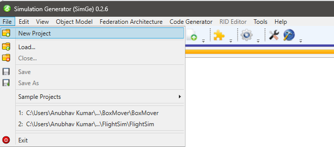

3. Provide project name and click ‘Create'.

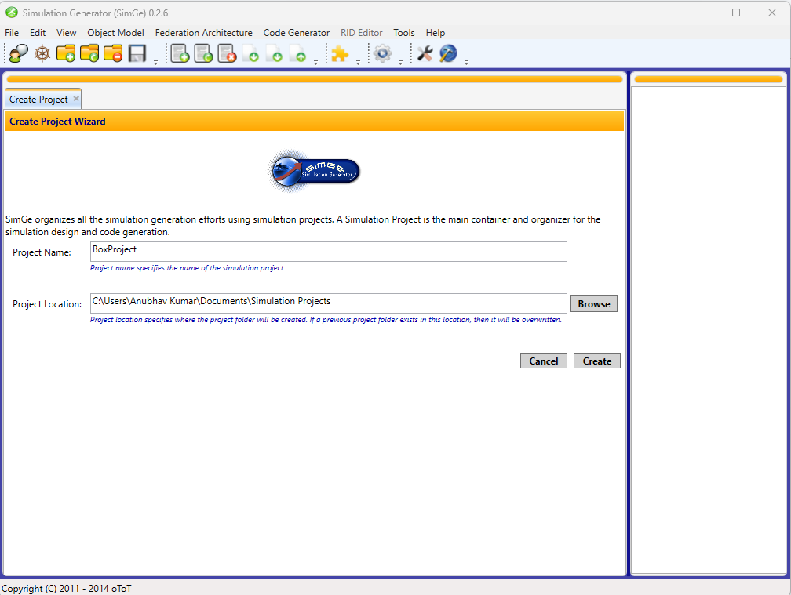

4. Next, go to Object Model > Create New FOM/SOM

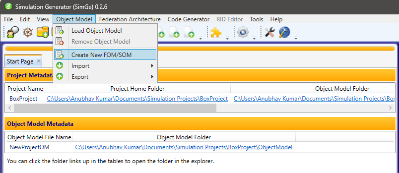

5. Then, you will see a screen (shown below). The first tab identification is important to make your FOM unique, so fill it out, accordingly.

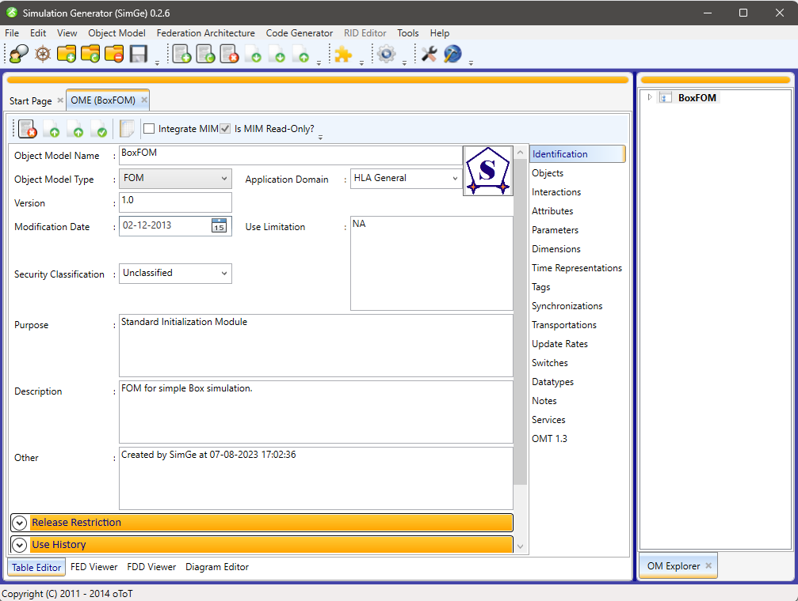

6. Next, navigate to Objects present in the right hand sidebar, and click on ‘Add new item’.

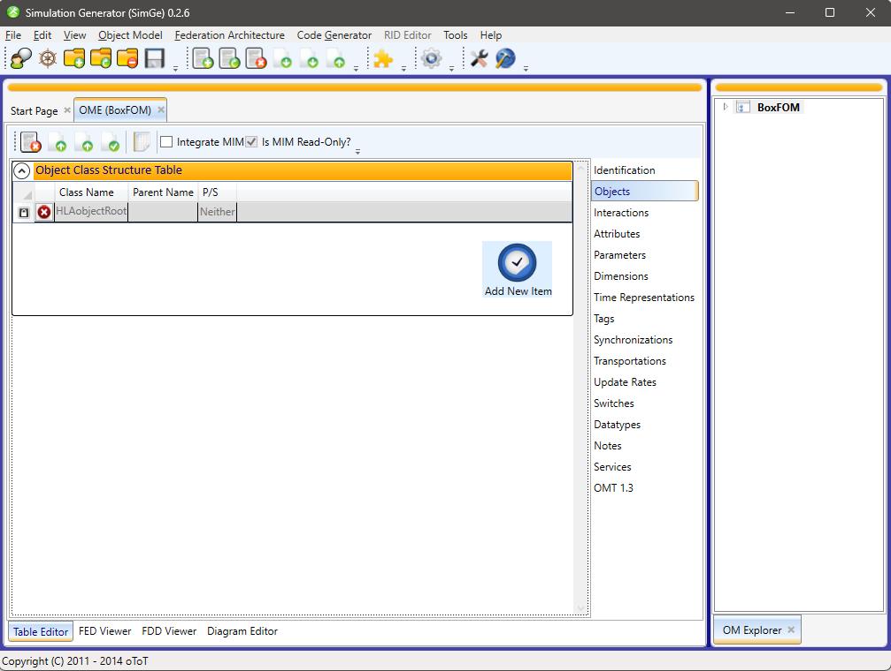

7. Create an object class based on your requirement. Here, we will create a “Box” object class, under the parent `HLAobjectRoot` and select the actions whether it should `Publish or Subscribe or both`.

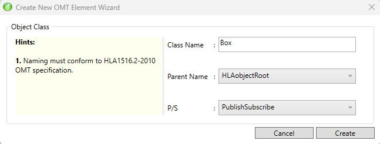

8. Next, we will add some attributes under the “Box” object class. For that, go to `Attributes` and click 'Add new item'. You will see a window similar to the snapshot below. Fill it out and create an attribute under the “Box” object.
    
    As you ca see below, under Object we have “Box” selected and for data type we have `HLAfloat64Time` and other details.
    

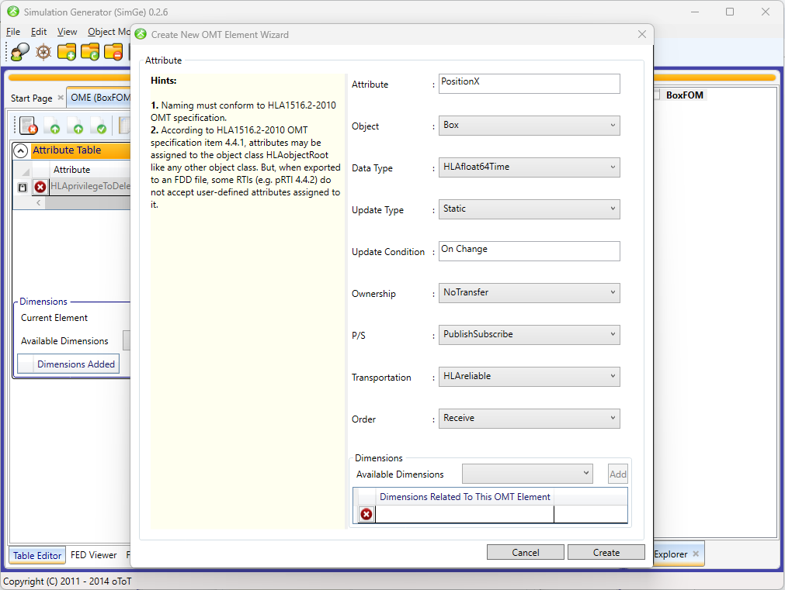

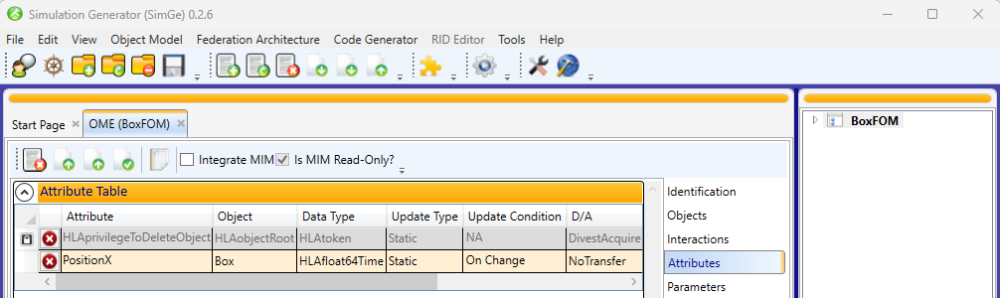

9. What if we need a custom data type rather than the one present in the data type options. Simply go to ‘Data types’. Under the Simple Data Type Table, ‘Add new item’.

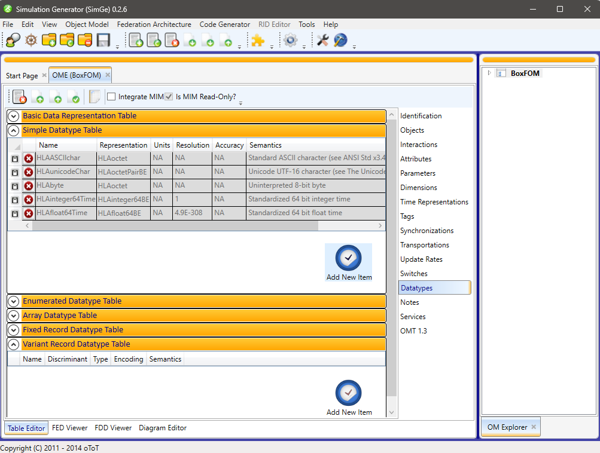

You will see a popup like this (shown below), and you can create a custom type with a certain default representation.

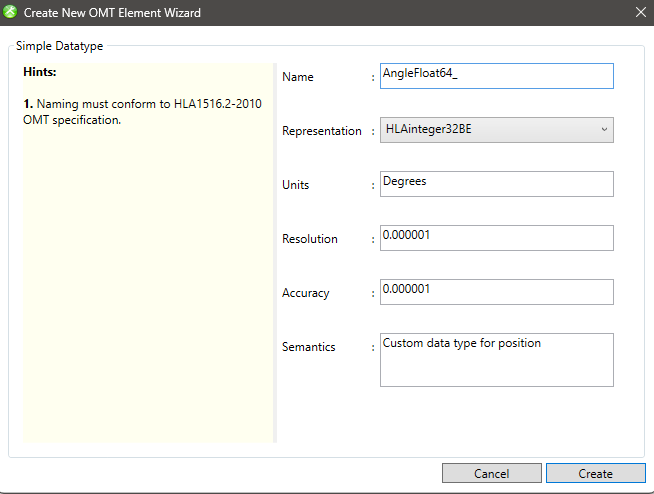

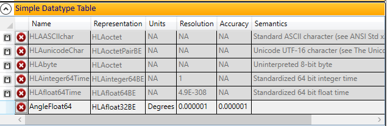

You can now switch the data type of existing attributes or create new ones.

1. After adding all the necessary attributes, we now export.
    
    Go to: Object Model > Export > Export to HLA-1.3 FED/HLA1516-2010 FDD
    

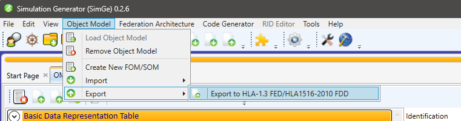

You will see a confirmation popup.

Select you FOM and for standard, go for HLA 1516-2010 FDD, as it is an evolved version, generating XML FOM file, which we will need when utilizing the plugin.

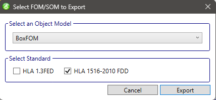

With this, we have our `BoxFOM.xml` file ready for use.

Note: You can also create **‘Interaction class’** following around the same steps that we used to create **‘Object class’**. Just instead of **‘Attributes’** you will add **‘Parameters’**.

### **Plugin (Using C++)**

To establish a connection between RTI & Unity Simulation System, we need to implement a Wrapper dll file for HLA in C++. This wrapper plugin will be a static one, as it will already be defined in the wrapper, what data/information can be sent or received. We can try to make it more robust and dynamic, but for the current requirement, this method suffices.

So to follow, as shown in the diagram below, we will have a FOM file defining our structure of information. Based on the given structure, we will implement our Wrapper plugin, which will handle scenarios such as

- Establish Connection with RTI
- Create a Federation Execution
- Create Object along with its attributes
- Publish/Subscribe
- Update Object attributes
- Disconnect from RTI+

.png)

<aside>
💡 **Note:** Initializing a C++ project with CMake.

</aside>

First we need our project to have access to the needed headers & libraries, to do so add the following:

```json
{
  “configurations”: [
    “includePath”: ["C:/Program Files/prti1516e/include"],
    "windowsSdkVersion": "10.0.22000.0",
    "compilerPath": "cl.exe",
    "cStandard": "c17",
    "cppStandard": "c++14",
    "intelliSenseMode": "windows-msvc-x64"
  ]
}
```

```
#### Snippet ####
# Compiler Options
if (CMAKE_SYSTEM_NAME STREQUAL "Windows")
    add_compile_options(/D_HAS_AUTO_PTR_ETC=1)
    set(LIB_DIR "C:/Program Files/prti1516e/lib/vc141_64")
    set(FEDERATE_LIBS "librti1516e64" "libfedtime1516e64")
endif()

# Add the include directories for Pitch headers
include_directories("C:/Program Files/prti1516e/include")

# Add the library directory for Pitch libraries (if necessary)
link_directories("C:/Program Files/prti1516e/lib/vc141_64")

# List your header and source files
set(HEADER_FILES
    <your_custom_headers>
)

# Add main.cpp file of project root directory as source file
set(SOURCES 
    <your_cpp_files>
)

# Create a shared library (DLL) with the given sources
add_library(hla_plugin SHARED ${HEADER_FILES} ${SOURCES})
# Add the main.cpp file to the project
add_executable(test ${HEADER_FILES} ${SOURCES})

target_link_libraries(hla_plugin "C:/Program Files/prti1516e/lib/vc141_64/librti1516e64.lib")
```

With this we have our project setup with all the required files and settings.

Now, let’s start with the implementation.

First we need to define a class `baseFederate`  that inherits `NullFederateAmbassador` and utilizes the namespace `rti1516e` in order to get access to RTI related methods. Then we define some private variables, and public methods.

```cpp
#include <RTI/NullFederateAmbassador.h>
#include <RTI/RTIambassadorFactory.h>
#include <RTI/RTIambassador.h>
#include <string>
#include <memory>

using namespace rti1516e;
namespace RTI = rti1516e;

class baseFederate: public NullFederateAmbassador
{
private:
    bool _connect;
    wstring _federationName;
    shared_ptr<RTIambassador> _rtiAmbassador;

public:
    // Constructor
    baseFederate();

    // Destructor
    ~baseFederate();

    // RTI connect/disconnect methods
    void connect(wstring federationName, wstring federateName, wstring fomFilePath);
}
```

### Register RTIAmbassador

<aside>
💡 **Note:**  `Debug::Log`  is a custom logger. 
You can simply use `std::cout >> “your_messgae” >> endl;`

</aside>

```cpp
#include "baseFederate.h"

baseFederate::baseFederate()
{
    _connect = false;
}

baseFederate::~baseFederate() {}

void baseFederate::connect(wstring federationName, wstring federateName, wstring fomFilePath)
{
    Debug::Log("Starting connection...");

    _federationName = federationName;

    // Code here //
}
```

In the above code, we have included the custom header that we have created at 1st step and initialized the constructor, destructor & connect method.

‘***function connect:’*** This function takes 3 parameters which are self explanatory. This function is what will help us in establishing the connection between our system and the RTI.

In order to interact with RTI, we need something named ****`rtiAmbassador`**.**

`rtiAmbassador` **is a critical component that acts as an interface between a federate (a participant in the simulation) and the underlying HLA runtime infrastructure. It provides a way for the federate to interact with the simulation environment, exchange data with other federates, and coordinate simulation activities.**

```cpp
// From RTIambassadorFactor instance create RTIambassador
shared_ptr<RTIambassadorFactory> rtiAmbassadorFactory(new RTIambassadorFactory());
_rtiAmbassador = rtiAmbassadorFactory->createRTIambassador();
```

**Connect to RTIAmbassador**

Now that we have our `rtiAmbassador`, we can establish our connection.

```cpp
// Call to connect to RTI -> informs the HLA runtime that the current class instance is ready to participate 
// in the federation and specifies that it should join the federation immediately
_rtiAmbassador->connect(*this, HLA_IMMEDIATE);

_connect = true;    // If connection established
```

**Create Federation**

A federation execution will create a virtual environment that allows multiple simulations participating entities to interact and share information, and simulate a complex scenario.

```cpp
// create federation execution
_rtiAmbassador->createFederationExecution(federationName, fomFilePath);
```

**Join Federation**

```cpp
// Join the federation. If the federate name is taken,
// add a sequence number to it to make it unique and try again.
bool joined = false;
int sequenceNumber = 1;
wstring uniqueName = federateName;

while(!joined)
{
    try
    {
        FederateHandle federateHandle = _rtiAmbassador->joinFederationExecution(uniqueName, federationName);

        joined = true;
        federateName = uniqueName;
    }
    catch(const FederateNameAlreadyInUse&)
    {
        uniqueName = federateName + L"_" + toWString(sequenceNumber);
        ++sequenceNumber;
    }
}
```

With this our connection method comes to an end. Using the connect method we have established a connection with RTI, created a federation and joined that federation.

Similar to connect, we have disconnect (in the snippets haven’t added try/catch block, but need to add for exceptions).

**Disconnect from RTIAmbassador**

```cpp
void baseFederate::disconnect()
{
    // When we disconnect from the federation execution we want to: 
    //  - Cancel any pending ownership acquisitions
    //  - Delete the objects created by us
    //  - Divest any owned attributes
    _rtiAmbassador->resignFederationExecution(CANCEL_THEN_DELETE_THEN_DIVEST);

    // Just as we try and create the federation execution we will try and 
    // destroy it since we cannot know if we're the last one to resign.
    _rtiAmbassador->destroyFederationExecution(_federationName);

    // Disconnect from the federation
    _rtiAmbassador->disconnect();

    _connect = false;
}
```

**Data Structure**

Now that we have a base ready it’s time for data structure or information structure of the simulation that needs to be shared. As we have already generated FOM, we know the structure of it so all we need to do is let our wrapper know of it.

```cpp
#pragma once
#ifdef HLAPLUGIN_EXPORTS
    #define HLAPLUGIN_API __declspec(dllexport)
#else
    #define HLAPLUGIN_API __declspec(dllimport)
#endif

struct HLAPLUGIN_API BoxObjectData
{
    int id;
    float positionX;
    float positionY;
};
```

In the `DataInterface.h` file, we define a structure of **‘BoxObject’** which is a part of this **HLAPLUGIN**, have following attributes, `positionX` & `positionY` of type and id for unique identification of type integer. With this we have our data format ready and now we need to perform some actions based on the Object class to share and retrieve the information.

<aside>
💡 **Note:** It is suggested to use a parent Simulation Object to access child objects, but since we only have a small data chart of BOX, we will simply move on with this. But for more than one object such as Aircraft, Tank etc. it's best to create a simulation object which will share its properties with all the other Objects and manage it.

</aside>

<aside>
🛠 We can also change `float` to `double` → to do so we need to update `HLAfloat32LE` to `HLAfloat64LE`

</aside>

**Object Handler**

Next, we create a BoxObject handler, whose job is to initialize the object, get the given object’s attributes along with its values that can be shared with other simulations, and update the attributes value.

```cpp
#include "BoxObject.h"

HLAfloat32LE BoxObject::floatDecoder;
int BoxObject::idCount = 0;

ObjectClassHandle BoxObject::boxObjectHandle;

AttributeHandle BoxObject::positionXHandle;
AttributeHandle BoxObject::positionYHandle;

bool BoxObject::initiated = false;

// Initialize the BoxObject class
void BoxObject::init(shared_ptr<RTIambassador> _rtiAmbassador)
{
    // Get handles for object class and attributes
    boxObjectHandle = _rtiAmbassador->getObjectClassHandle(L"HLAobjectRoot.Box");
    positionXHandle = _rtiAmbassador->getAttributeHandle(boxObjectHandle, L"PositionX");
    positionYHandle = _rtiAmbassador->getAttributeHandle(boxObjectHandle, L"PositionY");
    
    initiated = true;
}

// Get the attribute set for this BoxObject
void BoxObject::getAttributeSet(AttributeHandleSet * attributeSet)
{
    // Insert attribute handles into the provided set
    attributeSet->insert(positionXHandle);
    attributeSet->insert(positionYHandle);
}

// Constructor with instance handle
BoxObject::BoxObject(ObjectInstanceHandle hlaInstanceHandle)
{
    // Initialize instance-specific properties
    id = idCount;
    idCount++;

    this->hlaInstanceHandle = hlaInstanceHandle;

    positionX = 0.0;
    positionY = 0.0;
}

// Update attributes based on provided values
void BoxObject::updateAttributes(AttributeHandleValueMap const & theAttributeValues)
{
    // Update Position X attribute if provided
    AttributeHandleValueMap::const_iterator 
    toUpdate = theAttributeValues.find(positionXHandle); // Position X
    if (toUpdate != theAttributeValues.end())
    {
        floatDecoder.decode(toUpdate->second);
        positionX = floatDecoder.get();
    }
    // Update Position Y attribute if provided
    toUpdate = theAttributeValues.find(positionYHandle);
    if (toUpdate != theAttributeValues.end())
    {
        floatDecoder.decode(toUpdate->second);
        positionY = floatDecoder.get();
    }
}

// Create a map of attributes to provide
void BoxObject::getAttributeMap(AttributeHandleSet const & theAttributes, AttributeHandleValueMap * attributeMap)
{
    // Get and encode Position X attribute if requested
    AttributeHandleSet::const_iterator
    toProvide = theAttributes.find(positionXHandle);    // Get position X
    if (toProvide != theAttributes.end())
    {
        floatDecoder.set(positionX);
        attributeMap->insert(pair<AttributeHandle, VariableLengthData>(*toProvide, floatDecoder.encode()));
    }
    // Get and encode Position Y attribute if requested
    toProvide = theAttributes.find(positionYHandle);
    if (toProvide != theAttributes.end())
    {
        floatDecoder.set(positionY);
        attributeMap->insert(pair<AttributeHandle, VariableLengthData>(*toProvide, floatDecoder.encode()));
    }
}

// Create a map of all attributes
void BoxObject::getAttributeMap(AttributeHandleValueMap * attributeMap)
{
     // Encode Position X attribute and add to map
    floatDecoder.set(positionX);
    attributeMap->insert(pair<AttributeHandle, VariableLengthData>(positionXHandle, floatDecoder.encode()));
    // Encode Position Y attribute and add to map
    floatDecoder.set(positionY);
    attributeMap->insert(pair<AttributeHandle, VariableLengthData>(positionYHandle, floatDecoder.encode()));
}

// Set properties based on provided data
void BoxObject::setBoxObject(BoxObjectData boxObjectData)
{
    positionX = boxObjectData.positionX;
    positionY = boxObjectData.positionY;
}

// Get data to send to other simulations
BoxObjectData BoxObject::getBoxObjectData()
{
    BoxObjectData data;

    data.id = id;
    data.positionX = positionX;
    data.positionY = positionY;

    return data;
}
```

**Create & Update the object and its attributes**

In order for the Federation to recognize the object and share its representation and make it interoperable, we need to register object instance of the shareable object.

```cpp
int baseFederate::createUnit()
{
    ObjectInstanceHandle obj = _rtiAmbassador->registerObjectInstance(BoxObject::boxObjectHandle);
    BoxObject newBox(obj);
    _box.push_back(newBox);

    return newBox.id;
}
```

Next we will register a function to update the attribute values when called upon

```cpp
void baseFederate::updateUnit(BoxObjectData boxObjectData)
{
    vector<BoxObject>::iterator it;
    it = find_if(_box.begin(), _box.end(), [&](BoxObject const & obj) {
        return obj.id == boxObjectData.id;
    });

    if (it != _box.end())
    {
        it->setBoxObject(boxObjectData);
        AttributeHandleValueMap attributeMap;
        it->getAttributeMap(&attributeMap);
        _rtiAmbassador->updateAttributeValues(it->hlaInstanceHandle, attributeMap, VariableLengthData());
    }
    else
    {
        Debug::Log("Unable to find any object");
    }
}
```

**Publish the object**

It refers to the act of making data available for other federates to receive. When a federate publishes data, it indicates that it is willing to share certain information about the state of objects or events with other federates.

```cpp
void baseFederate::publishUnit()
{
    try
    {
        if (!BoxObject::initiated)
        {
            BoxObject::init(_rtiAmbassador);
        }
        
        // Get handles for the object class and attributes
        AttributeHandleSet boxObjectAttribute;
        BoxObject::getAttributeSet(&boxObjectAttribute);

        // Publish the attributes
      _rtiAmbassador->publishObjectClassAttributes(BoxObject::boxObjectHandle, boxObjectAttribute);
    }
    catch(const Exception& e)
    {
        Debug::Log(e.what());
    }
}
```

**Subscribe to the object**

Subscribing refers to the act of interest in receiving data from other federates. A federate can subscribe to a published object or event and receive updates about certain attributes or interactions related to that object or event.

```cpp
void baseFederate::subscribeUnit()
{
    try
    {
        if (!BoxObject::initiated)
        {
            BoxObject::init(_rtiAmbassador);
        }
        AttributeHandleSet boxAttribute;
        BoxObject::getAttributeSet(&boxAttribute);
    _rtiAmbassador->subscribeObjectClassAttributes(BoxObject::boxObjectHandle, boxAttribute);

        Debug::Log("Unit subscribed");
    }
    catch(const Exception& e)
    {
        Debug::Log(e.what());
    }   
}
```

### **Create DLL (package)**

1. Create a build/ directory and change directory to
    
    `mkdir build && cd build/`
    

1. Compile the code to create a VS Solution
    
    `cmake ../<path_to_CMake.txt>`
    

1. Now inside the build/ folder we have our `.sln` file. Open the file and generate a release x64 build for `hla_plugin` solution. With this, inside the build folder, the Release directory we will get the `hla_plugin.dll` file which we can use in our Unity project.

### **DLL utilization in Unity**

1. Import the dll file in unity project’s Assets →Plugin → hla_plugin.dll
2. Define the same data structure that we have defined in the DLL project.
    
    ```cpp
    // Define the same data structure that is being used in dll 
    public struct BoxData {
        public int id;
        public float positionX;
        public float positionY;
    }
    ```
    
3. Now create a script to declare all the functions that we will be utilizing in our Unity project. As shown below:
    
    ```cpp
    public class Federate: MonoBehaviour
    {
        [DllImport("hla_plugin.dll")]
        public static extern void Connect(string federationName, string federateName, string fomFilePath);
    
        [DllImport("hla_plugin.dll")]
        public static extern void Disconnect();
    
        // Test Sim methods
        [DllImport("hla_plugin.dll")]
        public static extern void PublishUnit();
    
        [DllImport("hla_plugin.dll")]
        public static extern void SubscribeUnit();
    
        [DllImport("hla_plugin.dll")]
        public static extern int CreateUnit();
    
        [DllImport("hla_plugin.dll")]
        public static extern void UpdateUnit(BoxData objData);
    }
    ```
    
4. Now in our project we can simply create an object of the BoxObject data type
    
    ```cpp
    public BoxData boxData;
    ```
    
5. Below are the following code for utilizing the above declared dll methods.
    
    ```cpp
    private void Start() {
            EstablishHLAConnection();
        }   
    
        // Function to establish HLA connection
        public void EstablishHLAConnection()
        {
            // Get the path to the project's "Assets" folder
            string projectPath = Application.dataPath;
    
            // Append the relative path to the FOM file
            // string fomFileName = "FOM/FlightSimBase.xml";
            string fomFileName = "FOM/BoxFOM.xml";
            string fomFilePath = System.IO.Path.Combine(projectPath, fomFileName);
            fomFilePath = System.IO.Path.GetFullPath(fomFilePath);
    
            // Pitch RTI plugin test
            try {
                Debug.Log( fomFilePath);
                Federate.Connect("Test_Federation", "Unity", fomFilePath);
                Federate.PublishUnit();
                Federate.SubscribeUnit();
    
                int obj_id;
                obj_id= Federate.CreateUnit();
                boxData.id = obj_id;
    
                Debug.Log("unit id: " + obj_id);
           }
            catch (Exception e)
            {
                Debug.Log("Error occurred: " + e);
            }
        }
    
        public void UpdateHLAData(Vector3 position)
        {
            try
            {
                boxData.positionX = position.x;
                boxData.positionY = position.y;
    
                Federate.UpdateUnit(boxData);
            }
            catch (Exception e)
            {
                Debug.Log("Update error occurred: " + e);
            }
        }
    
        private void OnDestroy() {
            Federate.Disconnect();
        }
    ```
    

Below are the screenshots of how we can verify that our simulation has established connection with RTI and have published mentioned object/event data.

.png)

.png)

.png)

.png)

### **References & Resources**

1. **Github Repo:** 
    - Branch main has a starting boilerplate
    - Branch `feature/test-sim` contains an example of a box object.
    - Branch `update/vr-sim` contains the data format used in vr-sim
2. **Pitch RTI -** [https://pitchtechnologies.com/prti/](https://pitchtechnologies.com/prti/)
3. **SimGe -** [https://user.ceng.metu.edu.tr/~otopcu/simge/](https://user.ceng.metu.edu.tr/~otopcu/simge/)